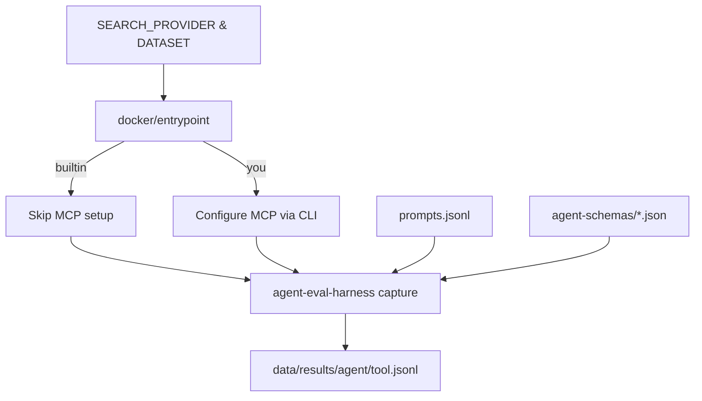

# Web Search Agent Evaluations

Evaluate multiple agents (Claude Code, Gemini, Droid, Codex) with different web search tools (builtin, You.com MCP) in isolated Docker containers.

## Overview

This evaluation system runs a matrix comparison: **4 agents × 2 tools = 8 pairings**, capturing full trajectories for analysis.

**Key Features:**
- **Headless Adapters**: No custom code, just JSON schemas using [@plaited/agent-eval-harness](https://www.npmjs.com/package/@plaited/agent-eval-harness).
- **Bun Runtime**: Fast TypeScript execution for all scripts.
- **Docker Isolation**: Each agent/tool pairing runs in its own container.
- **MCP Support**: First-class support for Model Context Protocol (MCP) servers like You.com.
- **Hybrid Grading**: Scoring using both deterministic metrics and LLM-based quality assessment.

### Evaluation Pipeline



## Quick Start

### 1. Prerequisites
- **Bun**: [Install Bun](https://bun.sh) (`curl -fsSL https://bun.sh/install | bash`)
- **Docker**: Ensure Docker Desktop is running.

### 2. Install Dependencies
```bash
bun install
```

### 3. Configure Environment
Create a `.env` file with your API keys:
```bash
cp .env.example .env
```
Required keys:
- `ANTHROPIC_API_KEY`: For Claude Code
- `GEMINI_API_KEY`: For Gemini agent & Inline Grader
- `FACTORY_API_KEY`: For Droid agent
- `OPENAI_API_KEY`: For Codex agent
- `YDC_API_KEY`: For You.com MCP tool

### 4. Generate Test Prompts
```bash
bun run sample:test        # Generate 5 test prompts
bun run sample:trials      # Generate 30 prompts for trials
```

## Running Evaluations

The `scripts/run.ts` script orchestrates Docker containers for evaluations.

### Basic Usage
```bash
# Run all agents in test mode (default)
bun scripts/run.ts

# Run in full mode (151 prompts)
bun scripts/run.ts --mode full
```

### Advanced Usage
```bash
# Run specific agent
bun scripts/run.ts --agent claude-code

# Run specific search provider
bun scripts/run.ts --search-provider you

# Control concurrency
bun scripts/run.ts --concurrency 4           # Max 4 containers
bun scripts/run.ts --prompt-concurrency 5    # 5 prompts per container

# Dry run (see what would happen)
bun scripts/run.ts --dry-run
```

## Comparing Results

The `scripts/compare.ts` script generates statistical or weighted comparisons.

### Usage
```bash
# Compare test results (weighted score)
bun scripts/compare.ts --mode test

# Compare full results with statistical significance
bun scripts/compare.ts --mode full --strategy statistical

# Filter comparison
bun scripts/compare.ts --agent gemini --search-provider you
```

## Reliability Trials (Pass@k)

The `scripts/run-trials.ts` script runs multiple trials to measure reliability.

### Usage
```bash
# Run trials (k=5) for all agents
bun scripts/run-trials.ts

# Capability testing (k=10)
bun scripts/run-trials.ts --trial-type capability

# Specific configuration
bun scripts/run-trials.ts --agent claude-code -k 10
```

## Project Structure

```
.
├── agent-schemas/          # Agent adapter definitions (JSON)
├── data/                   # Prompts and results
├── docker/                 # Dockerfiles and entrypoint
├── scripts/
│   ├── run.ts              # Main execution runner
│   ├── compare.ts          # Analysis and comparison tool
│   ├── run-trials.ts       # Reliability trials runner
│   ├── inline-grader.ts    # Hybrid grading logic
│   └── shared/             # Shared utilities (args, types)
├── mcp-servers.ts          # MCP server configurations
└── package.json            # Dependencies and scripts
```

## Troubleshooting

- **Docker Errors**: Ensure Docker is running. Try `docker compose down --volumes` to clear state.
- **API Errors**: Check `.env` keys. Use `printenv | grep KEY` inside containers to verify.
- **Linting**: Run `bun run check` to verify code quality.

## License
MIT
